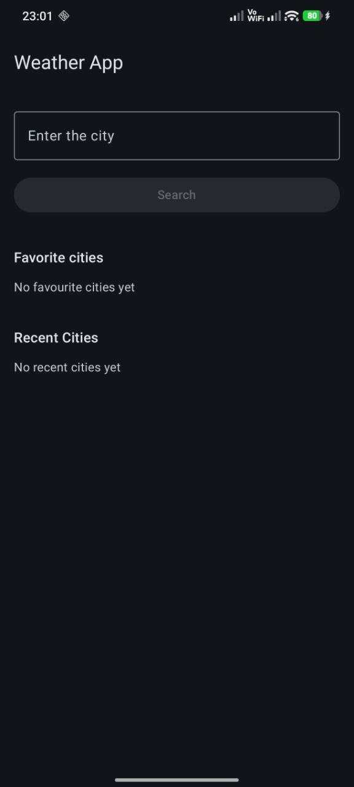
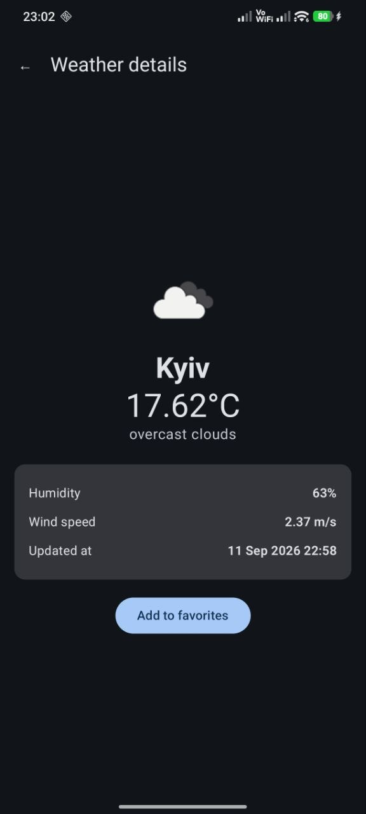
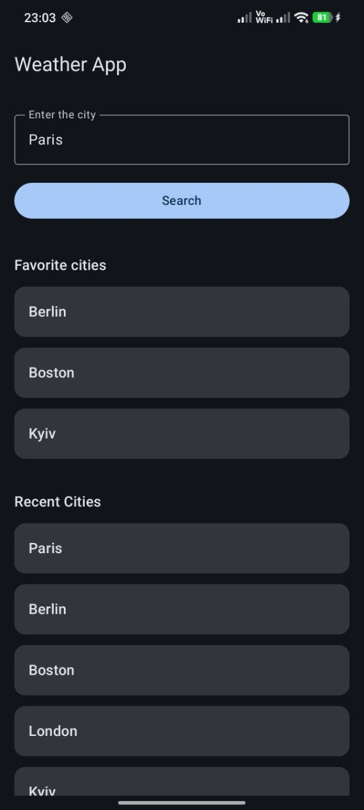

# WeatherApp 🌦️

WeatherApp is an Android application for searching current weather by city.

The app fetches weather data from a remote API, displays detailed weather information, and allows users to save favorite cities and view recent searches.

## 📱 Screenshots

<p>
  
  
  
</p>

## ✨ Features

* Search current weather by city
* View detailed weather information
* Weather icons based on current conditions
* Loading, success, and error UI states
* Retry weather requests after an error
* Save favorite cities
* Store favorite cities locally with Room
* View recent successful searches
* Navigate between Search and Weather Details screens
* Empty states for favorites and recent searches

## 🛠 Tech Stack

* Kotlin
* Jetpack Compose
* Material 3
* Retrofit
* OkHttp
* Room
* Coroutines
* StateFlow
* ViewModel
* Navigation Compose
* Coil
* KSP

## 🏗 Architecture

The project follows a layered architecture with MVVM principles.

```text
Presentation
    ↓
ViewModel
    ↓
Repository
    ↓
Data Sources
   ↙     ↘
Room    REST API
```

Dependencies are created in a central `AppContainer` using manual dependency injection.

The application separates UI logic, business/data access logic, local persistence, and remote API communication.

## 🌐 Weather API

Weather data is loaded from the OpenWeather API.

The API key is not stored in the repository. It should be added to the local `local.properties` file:

```properties
OPEN_WEATHER_API_KEY=your_api_key_here
```

## 🚀 Running the Project

1. Clone the repository.
2. Open the project in Android Studio.
3. Add your OpenWeather API key to `local.properties`.
4. Sync the Gradle project.
5. Run the application on an emulator or Android device.

## 📂 Main Project Structure

```text
app/src/main/java/.../weatherapp/
├── data/
│   ├── local/
│   ├── remote/
│   ├── mapper/
│   └── repository/
│
├── domain/
│   ├── model/
│   └── repository/
│
├── presentation/
│   ├── common/
│   ├── search/
│   ├── details/
│   └── navigation/
│
├── di/
│   └── AppContainer.kt
│
├── MainActivity.kt
└── WeatherApplication.kt
```

## 📚 What I Practiced

This project was created to practice modern Android development, including REST API integration, Room persistence, reactive UI state, MVVM architecture, repository pattern, manual dependency injection, and Jetpack Compose UI development.
